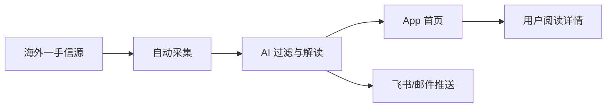
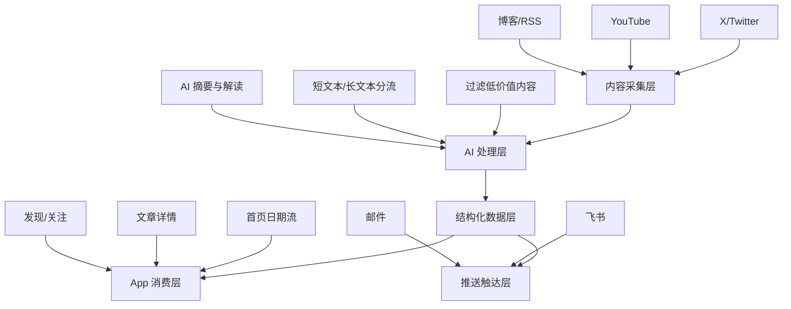
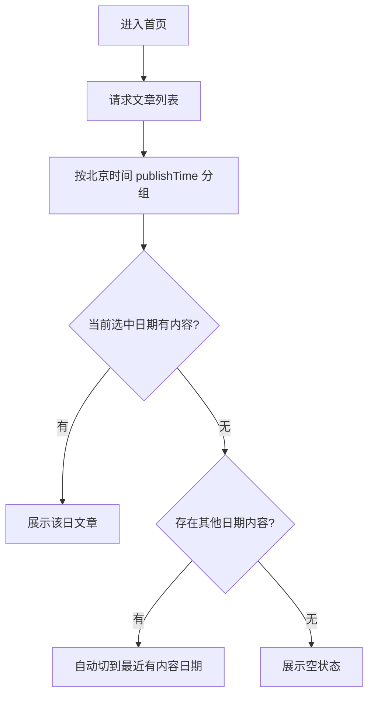
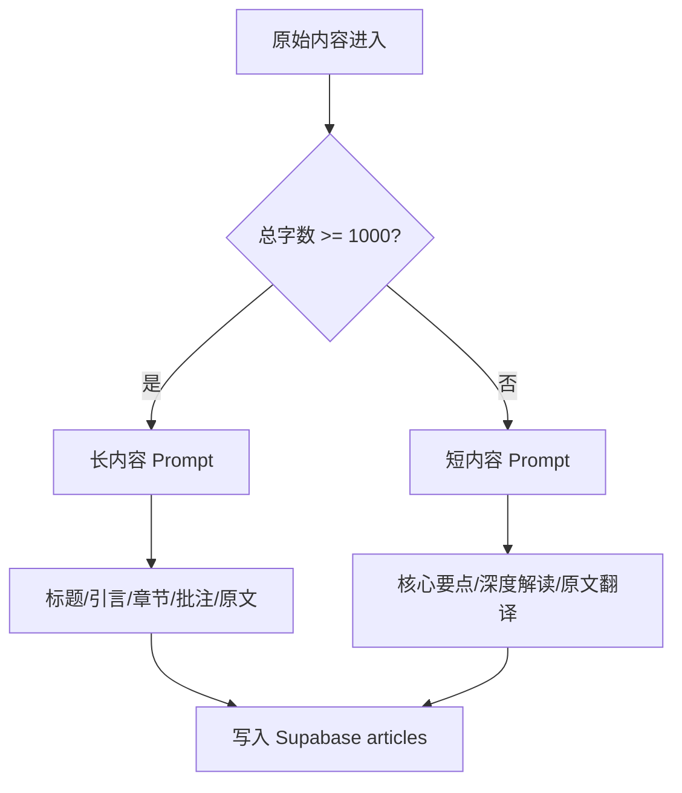
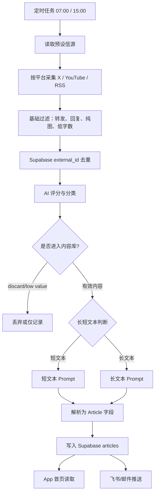

# 硅谷速递 PRD

> 版本：V2.0  
> 日期：2026-04-30  
> 产品定位：面向中文 AI 从业者的海外一手科技信息聚合、AI 解读与定时推送工具  
> 参考资料：第一版《硅谷速递》PRD、PRD 模板、Prompt 迭代模板、当前代码库实现

## 一、需求背景

### 1.1 产品定义

**硅谷速递是一款面向中国 AI 爱好者、AI 产品经理、开发者、投资从业者和科技 KOL 的海外信息聚合工具。**

它通过 **自动采集海外信源、AI 中文摘要、结构化解读、App 信息流展示、飞书/邮件定时推送**，帮助用户每天用 5 到 20 分钟掌握硅谷 AI 与科技圈的关键信号。

一句话描述：**一手硅谷，中文速递。**

### 1.2 核心用户

| 用户类型 | 典型画像 | 核心痛点 | 价值主张 |
| --- | --- | --- | --- |
| AI 产品经理 | 一二线城市，25 到 40 岁，关注 AI 产品和创业 | 英文能看但费时，信息分散 | 每天快速知道重要 AI 产品动态 |
| 开发者/独立开发者 | 关注开源模型、工具、Agent、变现 | X、YouTube、博客来回切换成本高 | 获取技术和产品机会信号 |
| 投资/创业从业者 | 关注 a16z、YC、OpenAI、独立开发者 | 国内二手翻译有延迟和损耗 | 更早捕捉赛道趋势 |
| 科技内容创作者 | 需要持续输入海外素材 | 选题筛选成本高 | 获取可二次创作的信息源 |

### 1.3 需求来源

第一版 PRD 中明确了三个核心洞察：

1. **信息源头在硅谷**：AI 和科技领域的一手认知集中在 X、YouTube、博客、播客和海外机构官网。
2. **中文用户获取成本高**：网络、语言、时间和筛选能力形成多重门槛。
3. **用户习惯难建立**：大多数用户不会每天主动刷 X、YouTube、Reddit、RSS，需要有人替他们筛选、翻译和判断。

当前信息链条通常是：


问题是每一层都会带来 **24 到 72 小时延迟**，并且可能出现信息损耗和误读。

硅谷速递的目标链路是：



### 1.4 北极星指标

**北极星指标：每日有效阅读次数。**

定义：用户在 App 或推送中打开并阅读文章详情，或点击外部原文链接的次数。

辅助指标：

| 指标 | 定义 | 目标 |
| --- | --- | --- |
| DAU | 每日打开 App 的用户数 | 验证使用习惯 |
| 日报打开率 | 收到推送后打开 App 或点击详情的比例 | 验证推送价值 |
| 内容有效率 | AI 筛选后进入 App 的内容中，用户点击详情的比例 | 验证筛选质量 |
| 推送配置完成率 | 用户完成邮箱/飞书 webhook 和时间设置的比例 | 验证触达闭环 |
| 收藏/分享率 | 用户收藏或转发内容的比例 | 验证内容价值 |

### 1.5 阶段目标

当前阶段不是做完整信息平台，而是验证一个核心闭环：

**海外内容能否被自动采集、AI 筛选、结构化解读，并以足够好的阅读体验送达中文用户。**

MVP 成功标准：

- 每日能稳定产出 2 到 6 条高价值内容。
- 首页能按日期展示真实 Supabase 内容。
- X、YouTube、博客三类来源能正确显示来源标识。
- 用户能设置飞书/邮件推送时间。
- AI 输出结构可被前端稳定解析，不再出现详情页空白或无效摘要。

## 二、需求分析

### 2.1 为什么优先优化 AI 输出与 App 消费链路

第一版 PRD 已经覆盖：首页、发现页、关注页、我的页、推送设置、信源体系等完整产品蓝图。但当前最需要验证的是 **内容是否真的有价值**，而不是先做复杂的账号、会员和社交体系。

原因：

1. **内容质量是根问题**：如果 AI 摘要不稳定、标题不准、章节为空，任何 UI 优化都无法留住用户。
2. **推送是增长入口**：用户不会每天主动打开工具，飞书/邮件推送可以降低使用门槛。
3. **首页是核心消费场景**：用户需要在一个页面内按日期查看当天内容，快速判断今天有没有料。
4. **来源识别影响信任**：YouTube、X、博客的内容形态不同，来源标签必须清晰，用户才知道自己在读什么。

### 2.2 当前已实现能力

| 模块 | 当前状态 | 说明 |
| --- | --- | --- |
| 首页信息流 | 已实现 | 日期选择、搜索、卡片列表、空状态、下拉刷新 |
| 文章卡片 | 已实现 | 支持 X、YouTube、博客标签，白底卡片，阅读详情入口 |
| 详情页 | 已实现 | 支持 summary、content、chapters、aiComment |
| 发现页 | 已实现 | 搜索、频道筛选、分类标签 |
| 推送设置页 | 已实现 | 邮箱/飞书渠道、Webhook/邮箱输入、时间选择、保存设置 |
| 后端内容接口 | 已实现 | `/api/content?format=articles` 将 Supabase articles 转为前端 Article |
| AI 解析 | 已实现基础版 | 从 ai_analysis 中提取核心要点、深度解读、原文内容 |
| 飞书推送 | 已实现基础版 | 支持定时抓取后推送卡片 |

### 2.3 主要问题

| 问题 | 表现 | 影响 |
| --- | --- | --- |
| AI 输出结构不稳定 | V1 时 long content 的 `chapters[]` 为空 | 详情页章节区空白 |
| 短内容信息密度低 | 单行要点无背景说明 | 用户不知道为什么重要 |
| 解析器和 Prompt 不一致 | Prompt 输出有章节，但解析器无法容错 | AI 产出无法被 UI 正确消费 |
| 来源识别不准确 | YouTube 内容被显示成 X | 用户对内容来源产生误解 |
| 日期内容调取不完整 | 当前日期无内容时没有自动看到其他日期内容 | 用户误以为没有数据 |
| 推送时间选择不顺畅 | 时间滚轮无法拖动或时间不全 | 影响推送设置完成率 |

### 2.4 需求思路

本次 PRD 将产品拆成三层：



核心原则：**先保证内容处理链路可靠，再扩展更复杂的订阅、会员、个性化推荐。**

## 三、前端功能详情

### 3.1 首页

页面目标：让用户进入 App 后，在 5 分钟内看完当天最重要的 AI/科技动态。

| 模块 | 前端交互 | 后端/数据逻辑 |
| --- | --- | --- |
| 顶部导航 | 显示问候语、用户昵称、时间图标、产品名、推送设置按钮、搜索按钮 | 问候语根据当前时间自动变化：早上好、下午好、夜深了 |
| 搜索栏 | 点击搜索图标展开，支持搜索标题、摘要、来源、标签 | 前端对已拉取文章本地过滤 |
| 日期栏 | 默认选中今天，一屏展示 7 天完整选框，支持横向滚动 | 根据文章 publishTime 按北京时间分组 |
| 内容流 | 展示文章卡片，点击进入详情页 | 调用 `/api/content?format=articles` |
| 空状态 | 无内容时显示“该日期暂无内容”和自动更新时间说明 | 如果选中日期没有数据，不展示错误态 |

首页日期逻辑：



### 3.2 文章卡片

页面目标：让用户快速判断一条内容是否值得点开。

字段规范：

| 字段 | 展示规则 |
| --- | --- |
| 来源标签 | X 显示 X 样式，YouTube 显示经典 YouTube 图标，博客显示博客标签样式 |
| 内容分类 | 如产品信号、投资信号、技术洞察、深度分析 |
| 作者/频道 | 展示 sourceName 和 sourceHandle |
| 日期 | 展示 `M月D日` |
| 标题 | 优先使用真实 title，不用 AI 概括覆盖标题 |
| 摘要 | 展示 summary 或 aiSummary，最多 3 行 |
| 阅读时间 | 根据正文长度估算，最低 1 分钟 |
| 评分 | 如果存在 quality_score，展示分数标签 |

来源识别规则：

| platform | sourceType | 标签 |
| --- | --- | --- |
| `twitter` 或 `x` | `twitter` | X (Twitter) |
| `youtube` | `youtube` | YouTube |
| `blog`/`rss`/`website` | `blog` | 博客 |

### 3.3 文章详情页

页面目标：让用户从“看卡片”进入“读懂内容”。

详情页结构：

1. 来源信息区：来源、作者、日期、阅读时间。
2. 标题区：展示真实标题。
3. 核心摘要：展示 AI 提炼的一句话或引言。
4. 章节区：展示 `chapters[]`，支持展开核心要点。
5. AI 批注区：展示 `aiComment`，体现产品差异化判断。
6. 原文区：展示中文翻译或原文内容。
7. 外链区：跳转原始链接。

### 3.4 发现页

页面目标：解决“不知道关注什么”的问题。

| 模块 | 交互 |
| --- | --- |
| 搜索栏 | 搜索频道、博主、关键词 |
| 分类标签 | 横向滑动，点击标签筛选频道 |
| 频道卡片 | 展示频道名、描述、来源数量、关注按钮 |
| 频道详情弹窗 | 展示频道内具体信源 |

要求：

- 分类标签必须横向滚动顺滑。
- 点击最左侧或最右侧标签时，不应遮挡或丢失前后标签。
- 频道列表应按用户兴趣和订阅人数排序。

### 3.5 推送设置页

页面目标：让用户配置每日自动接收日报。

| 模块 | 交互 | 校验 |
| --- | --- | --- |
| 顶部栏 | 返回按钮 + 标题“推送设置” | 无 |
| 推送渠道 | 邮件、飞书二选一 | 选中态蓝色边框和勾选 |
| 邮箱输入 | 输入接收邮箱 | 必须符合邮箱格式 |
| 飞书输入 | 输入机器人 Webhook | 必须以 `https://open.feishu.cn/` 开头 |
| 时间选择 | 小时 00 到 23，分钟 00 到 59，支持点击/拖拽/滚轮 | 默认 08:00 |
| 保存按钮 | 校验通过后写入本地或后端设置 | 无效时禁用 |

推送设置数据结构：

```json
{
  "channel": "email",
  "target": "your@email.com",
  "time": "08:00"
}
```

### 3.6 后续版本页面

| 页面 | V2.0 范围 | 后续版本 |
| --- | --- | --- |
| 关注页 | 展示已订阅频道、开关推送 | 自定义信源、集合管理 |
| 我的页 | 用户信息、设置入口 | 会员权益、历史归档、收藏 |
| 会员页 | 暂不做 | Pro 订阅、无限频道、全文翻译 |

## 四、AI 后台细节

### 4.1 输入内容

AI 后台输入来自三类信源：

| 来源 | 内容类型 | 处理逻辑 |
| --- | --- | --- |
| X/Twitter | 短文本，单条或单日聚合 | 聚合后提炼核心要点、翻译、判断是否有料 |
| YouTube | 长视频字幕/转录 | 长文本结构化提炼，保留章节和关键观点 |
| 博客/RSS | 长文章 | 提取标题、引言、章节、批注、信息来源 |

过滤规则：

- 过滤转发。
- 过滤纯回复。
- 过滤纯图片无文字内容。
- 过滤正文少于 30 字的内容。
- 已抓取过的 external_id 不重复入库。

### 4.2 短文本/长文本分流

第一版 PRD 的核心判断是：**短信息是压缩，长信息是增值。**

当前建议继续沿用阈值：



### 4.3 AI 输出结构

#### 短文本输出

适用于 X/Twitter 单日聚合或低于 1000 字的内容。

```text
核心要点
一句话概括今日最重要的信息，不超过40字，直接说结论。

深度解读
100字到300字之间的一段话，解释这件事意味着什么、为什么重要、背后逻辑是什么。

原文翻译
[时间] [原创/转发/回复@xxx/引用@xxx]
原文：xxx
翻译：xxx
---
```

#### 长文本输出

适用于 YouTube、播客、博客、RSS 长文。

```text
文章标题
主体 + 核心观点

引言
3到5句话，讲清楚文章核心、冲击性数据、为什么现在值得读。

核心内容提炼
1. 章节标题
子要点标题：子要点内容

智能点评
关于核心主题：有判断的分析
关于延伸话题：被忽视的角度
底层判断：一句宏观结论

原文内容
中文翻译或原文整理
```

### 4.4 解析器要求

解析器要服务前端，而不是要求模型永远完美。必须支持以下容错：

| 场景 | 处理方式 |
| --- | --- |
| 标题前带 Markdown 标记 | 清理 `#`、`**` 等符号 |
| 章节标题有“一、”“1.” | 统一识别为 section heading |
| 子要点之间有空行 | 不影响提取 |
| 模型输出“独家批注”或“智能点评” | 都映射为 `aiComment` |
| 模型输出“原文翻译”或“原文内容” | 都映射为正文 content |
| 数据库已有 raw.chapters | 优先使用 raw.chapters |

Article 标准结构：

```ts
interface Article {
  id: string;
  title: string;
  summary: string;
  content: string;
  sourceType: 'twitter' | 'youtube' | 'blog' | 'wechat' | 'website' | 'podcast';
  sourceName: string;
  sourceIcon: string;
  sourceHandle?: string;
  publishTime: string;
  readTime: number;
  url: string;
  score?: number;
  aiSummary?: string;
  aiComment?: string;
  chapters?: Chapter[];
  contentCategory?: ContentCategory;
  priority?: ContentPriority;
}
```

### 4.5 完整后台流程



### 4.6 模型与成本

当前代码中使用 DeepSeek/OpenRouter 能力，Prompt 存储在 settings 表中，支持运行时更新和版本号刷新。

成本估算以 MVP 阶段为主：

| 项目 | 假设 | 估算 |
| --- | --- | --- |
| 每日采集源 | 30 到 80 个 |
| 每日进入 AI 分析内容 | 10 到 30 条 |
| 每条短文本 token | 1k 到 3k |
| 每条长文本 token | 8k 到 30k |
| 每日推送内容 | 2 到 6 条 |
| 成本策略 | 先过滤再分析，避免低价值内容进入长 Prompt | 控制在可接受范围内 |

## 五、数据结构与接口

### 5.1 Supabase articles 核心字段

| 字段 | 用途 |
| --- | --- |
| id | 数据库主键 |
| external_id | 平台内容唯一 ID，前端 Article id 优先使用 |
| platform | twitter/youtube/rss/blog |
| title | 真实标题 |
| original_content | 原文 |
| translated_content | 中文翻译 |
| ai_analysis | AI 输出全文 |
| author_name | 作者或频道名 |
| author_handle | 作者 handle |
| published_at | 发布时间 |
| fetched_at | 抓取时间 |
| link | 原文链接 |
| raw_data | 额外结构化字段 |
| quality_score | AI 质量评分 |
| content_category | 内容分类 |
| priority | high/medium/low/discard |

### 5.2 内容接口

接口：`GET /api/content?format=articles`

返回：

```json
{
  "articles": [
    {
      "id": "tweet_123",
      "title": "This is ChatGPT Images 2.0",
      "summary": "OpenAI 发布 ChatGPT Images 2.0...",
      "sourceType": "youtube",
      "sourceName": "OpenAI",
      "sourceIcon": "YouTube",
      "publishTime": "2026-04-29T08:00:00Z",
      "readTime": 2,
      "score": 92,
      "contentCategory": "product_signal",
      "chapters": []
    }
  ],
  "total": 1
}
```

排序规则：

1. `priorityWeight` 高的优先。
2. `quality_score` 高的优先。
3. `published_at` 新的优先。

## 六、评估与迭代优化

### 6.1 测试集

本次评估参考 Prompt 迭代模板中的 3 条 Case：

| Case | 类型 | 代表问题 |
| --- | --- | --- |
| a16z 长文 | 博客/长文本 | 章节提取、标题提取、独家批注 |
| Pieter Levels 推文 | X/短文本 | 要点是否有背景，是否避免套话 |
| Ethan Mollick 推文 | X/短文本 | 说明行是否有数据，批注格式是否稳定 |

评分维度：

| 维度 | 定义 |
| --- | --- |
| 易读性 | 用户能否快速理解重点，中文表达是否自然 |
| 完整性 | 关键标题、摘要、章节、批注、原文是否完整 |
| 结构规范性 | 输出能否被解析器稳定转为 Article/chapter 字段 |

### 6.2 Prompt 版本对比

| 版本 | 核心改动 | 主要效果 |
| --- | --- | --- |
| V1 | 原始版本 | 基础可用，但要点单行、长文章节空白 |
| V2 | 增加说明行、长文章节 `####` 标记、解析器重写 | 结构提升，但说明行有复述，批注格式不稳 |
| V3 | 双层子要点、说明行具化、批注三段式、解析器容错 | 方向正确，但还不是稳定上线版本 |

V3 的价值在于证明了一个方向：**Prompt 必须服务 App 的结构化展示，而不是只生成一篇看起来不错的文章。**

但 V3 仍然有明显问题：

1. **模拟输出好于真实输出**：模板里的 V3 示例比较理想，真实模型遇到不同来源、不同格式时仍会漂移。
2. **长文结构仍不够稳**：a16z 这种结构清晰的文章表现较好，但 YouTube 字幕、访谈、博客混合输入时，章节标题和子要点仍可能变形。
3. **Prompt 与当前线上解析存在错位**：当前代码库默认 Prompt 已经切到更简单的 `核心要点 / 深度解读 / 原文翻译` 三段式，牺牲了章节结构的丰富度，换来了更稳定的卡片摘要。
4. **来源识别不应只靠 Prompt**：YouTube 被识别成 X 的问题，本质是数据字段和平台归一化问题，不能指望模型自己判断。
5. **“有态度”与“稳定解析”存在冲突**：批注越像真人评论，格式越容易发散；格式越硬，内容又容易变机械。

### 6.3 逐 Case 评分

V1 评分：

| Case | 易读性 | 完整性 | 结构规范性 | 核心问题 |
| --- | ---: | ---: | ---: | --- |
| a16z 长文 | 5 | 6 | 3 | `chapters[]` 为空，详情页章节区空白 |
| Pieter Levels 推文 | 6 | 5 | 6 | 要点单行无解释，划重点套话 |
| Sam Altman 推文 | 5 | 6 | 5 | 标题泛化，无法展开 |

V2 评分：

| Case | 易读性 | 完整性 | 结构规范性 | 核心问题 |
| --- | ---: | ---: | ---: | --- |
| a16z 长文 | 8 | 8 | 7 | 子要点偶尔因为空行漏匹配 |
| Pieter Levels 推文 | 7 | 7 | 8 | 说明行偶尔复述标题 |
| Ethan Mollick 推文 | 7 | 7 | 6 | 独家批注格式偶尔不稳定 |

V3 评分（重新评估，按真实可落地标准，而不是理想样例标准）：

| Case | 易读性 | 完整性 | 结构规范性 | 真实评估 |
| --- | ---: | ---: | ---: | --- |
| a16z 长文 | 8 | 8 | 7 | 章节明显改善，但仍依赖原文结构清晰；遇到空行、标题变体、Markdown 层级变化时仍可能漏解析 |
| Pieter Levels 推文 | 7 | 8 | 8 | 要点比 V1 丰富，但“说明”仍偶尔复述标题，短内容容易为了显得有价值而过度解读 |
| Ethan Mollick 推文 | 8 | 8 | 7 | 信息密度提升，但批注格式仍会漂移，不能保证每次稳定落到 `aiComment` |

V3 不是失败版本，它解决了 V1 的大坑；但它也不是最终版本。更准确的定位是：**V3 是可用的 Prompt 方向验证版，不是生产稳定版。**

### 6.4 计算结果

计算方式：

- 单项平均分 = 3 个 Case 在该维度的平均值。
- 综合分 = 3 个 Case、3 个维度共 9 个分数的平均值。
- 单项通过率 = 9 个评分项中，分数大于等于 8 的比例。
- Case 通过率 = 每个 Case 的三个维度都大于等于 8，视为通过。

| 指标 | V1 | V2 | V3 | V1 到 V3 提升 |
| --- | ---: | ---: | ---: | ---: |
| 易读性均分 | 5.33 | 7.33 | 7.67 | +2.34，+43.9% |
| 完整性均分 | 5.67 | 7.33 | 8.00 | +2.33，+41.1% |
| 结构规范性均分 | 4.67 | 7.00 | 7.33 | +2.66，+57.0% |
| 综合分 | 5.22 | 7.22 | 7.67 | +2.45，+46.9% |
| 单项通过率 | 0/9，0% | 3/9，33.3% | 6/9，66.7% | +66.7 个百分点 |
| Case 通过率 | 0/3，0% | 0/3，0% | 0/3，0% | 仍未达到稳定通过 |

结论：

**V3 尚未达到稳定上线标准。**  
它相比 V1/V2 有明显进步，尤其是完整性从 5.67 提升到 8.00，说明内容不再只是“标题 + 空摘要”。但结构规范性只有 7.33，Case 通过率仍是 0/3，意味着只要一个维度低于 8，前端仍可能出现章节缺失、批注落空、卡片字段不准等问题。

因此，V3 的结论应改为：**可以作为 V4 的基础，但不能直接作为最终生产 Prompt。**

### 6.5 V4 迭代方向

V4 不应该继续只堆 Prompt 文案，而要做 **Prompt + 解析器 + 数据字段约束** 的联合迭代。

| 方向 | 问题 | V4 改法 |
| --- | --- | --- |
| 输出结构 | Markdown 层级和自然语言标题容易漂移 | 要求模型输出固定 JSON 草稿，后端校验后再转展示字段 |
| 来源识别 | YouTube/X/博客标签偶尔错 | 来源类型只读数据库 `platform` 字段，不交给模型判断 |
| 长文解析 | 章节和子要点仍不稳定 | 长文输出固定 `title / summary / chapters / aiComment / originalContent` |
| 短文摘要 | “说明”容易复述标题 | 明确说明行只能写“背景、数据、为什么重要”之一 |
| 批注 | 有态度但格式漂移 | 将批注限制为 2 到 3 个固定字段：`judgement`、`hiddenAngle`、`bottomLine` |
| 降级策略 | 解析失败时前端空白 | 若 chapters 为空，详情页自动降级为 `深度解读 + 原文翻译` |

V4 输出建议：

```json
{
  "title": "真实标题或重写后的中文标题",
  "summary": "80到160字摘要",
  "sourceType": "由后端填充，不由模型生成",
  "contentType": "short | long",
  "keyPoints": [
    {
      "title": "要点标题",
      "whyItMatters": "为什么重要"
    }
  ],
  "chapters": [
    {
      "title": "章节标题",
      "keyPoints": ["子要点1", "子要点2"]
    }
  ],
  "aiComment": {
    "judgement": "核心判断",
    "hiddenAngle": "容易被忽视的角度",
    "bottomLine": "底层判断"
  },
  "originalContent": "原文翻译或整理"
}
```

这样做的好处是：模型负责内容判断，后端负责字段可信度，前端负责展示。三者边界更清楚。

### 6.6 Bad Case 处理

| Bad Case | 级别 | 处理方案 | 验收标准 |
| --- | --- | --- | --- |
| 长文 `chapters[]` 为空 | P0 | Prompt 固定章节格式，解析器容错提取 | 长文本详情页必须至少有 1 个章节或降级展示正文 |
| YouTube 被识别为 X | P1 | platform 归一化，YouTube 使用独立 icon | YouTube 卡片来源标签正确 |
| 说明行复述标题 | P1 | Prompt 明确说明行只能写背景/数据/为什么重要 | 说明行不得只重复标题 |
| 批注格式不稳定 | P1 | 固定“关于 X / 关于 Y / 底层判断”三段式 | `aiComment` 非空且可读 |
| 日期无内容误导用户 | P2 | 有历史内容时默认切到最近有内容日期 | 用户能看到最近一次内容 |
| 时间选择器无法拖动 | P2 | 自控时间选择器，支持点击/拖拽/滚轮 | 小时 00 到 23、分钟 00 到 59 可选 |

### 6.7 上线标准

满足以下条件可上线：

- Prompt 测试综合分大于等于 8.2。
- Case 通过率大于等于 80%，且 P0 Case 通过率 100%。
- 无 P0 Bad Case。
- `npm run build` 通过。
- 首页能展示 Supabase 至少 2 个不同来源类型的真实内容。
- 推送设置页能完成邮箱或飞书配置保存。
- YouTube、X、博客来源标签显示正确。

当前判断：**V3 未达上线标准，需要进入 V4。**

## 七、里程碑

| 阶段 | 时间 | 目标 |
| --- | --- | --- |
| V2.0 MVP | 2026-04-30 前 | 打通真实内容读取、首页展示、Prompt 结构化解析、推送设置 |
| V2.1 | 2026-05 上旬 | 完善关注页、自定义信源、频道订阅关系 |
| V2.2 | 2026-05 中旬 | YouTube 字幕采集稳定化，博客 RSS 入库稳定化 |
| V2.3 | 2026-05 下旬 | 收藏、历史归档、会员权益雏形 |

## 八、未来迭代

1. **个性化日报**：根据用户关注频道、阅读行为、收藏行为调整排序。
2. **多渠道推送**：扩展邮件、飞书、Telegram、微信服务号。
3. **专题聚合**：同一主题多来源内容自动合并成专题。
4. **内容评分可解释**：展示为什么这条内容被 AI 选中。
5. **播客/视频专项解析**：识别多人对话、嘉宾观点、原话引用。
6. **付费能力**：Pro 用户解锁更多频道、全文翻译、历史归档和自定义信源。
